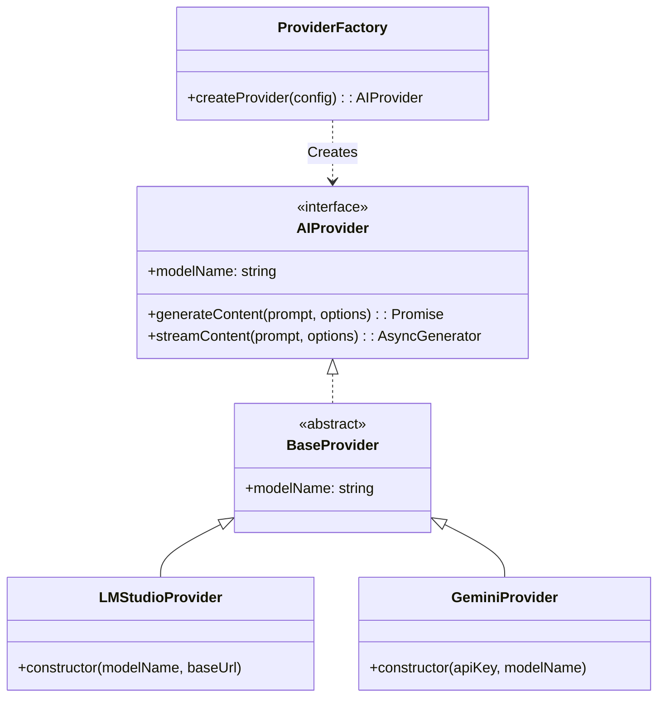

# AI機能仕様書

## 概要

本アプリケーションは、将来的なプロバイダー変更や拡張を容易にするために、抽象化されたAIプロバイダー層を持っています。
現在は以下のプロバイダーをサポートしています。

*   **LMStudio**: ローカルLLM実行環境
*   **Google GenAI (Gemini)**: Googleの生成AIモデル

## アーキテクチャ

AI機能は `src/main/ai` ディレクトリに集約されており、以下の構成になっています。



## インターフェース定義

### AIProvider

すべてのAIプロバイダーは `AIProvider` インターフェースを実装する必要があります。

```typescript
export interface AIProvider {
  /**
   * 使用しているモデルの識別名
   */
  readonly modelName: string;

  /**
   * プロンプトに基づいてコンテンツを生成します
   */
  generateContent(prompt: string, options?: GenerateOptions): Promise<string>;

  /**
   * コンテンツをストリーミング生成します
   */
  streamContent(prompt: string, options?: GenerateOptions): AsyncGenerator<string>;
}
```

### 共通オプション

```typescript
export interface GenerateOptions {
  temperature?: number; // 生成のランダム性 (0.0 - 1.0)
  maxTokens?: number;   // 最大生成トークン数
  systemPrompt?: string; // システムプロンプト
}
```

## 使用方法

`ProviderFactory` を使用してプロバイダーのインスタンスを生成します。

```typescript
import { ProviderFactory } from './src/main/ai';

// LMStudioの使用例
const localProvider = ProviderFactory.createProvider({
  type: 'lmstudio',
  modelName: 'local-model',
  baseUrl: 'http://127.0.0.1:1234'
});

const response = await localProvider.generateContent('こんにちは');

// Geminiの使用例
const geminiProvider = ProviderFactory.createProvider({
  type: 'gemini',
  apiKey: 'YOUR_API_KEY',
  modelName: 'gemini-1.5-flash'
});
```

## 拡張方法 (新しいプロバイダーの追加)

1.  `src/main/ai/providers` に新しいプロバイダーファイルを作成します (例: `OpenAIProvider.ts`)。
2.  `BaseProvider` を継承し、`generateContent` と `streamContent` を実装します。
3.  `src/main/ai/ProviderFactory.ts` の `ProviderType` と `ProviderConfig`、および `createProvider` メソッドを更新して、新しいプロバイダーをサポートします。
4.  `src/main/ai/index.ts` から新しいプロバイダーをエクスポートします。
