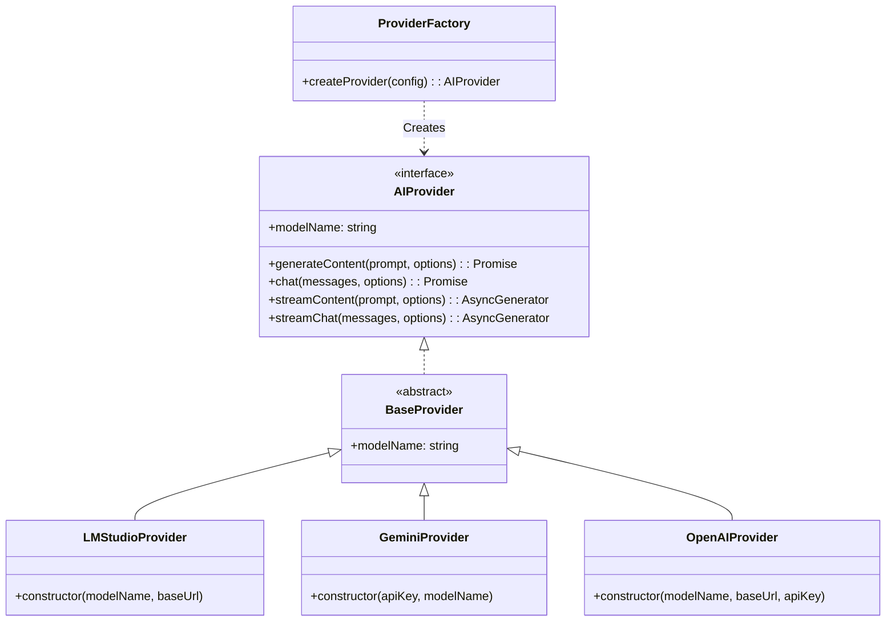

# AI機能仕様書

## 概要

本アプリケーションは、将来的なプロバイダー変更や拡張を容易にするために、抽象化されたAIプロバイダー層を持っています。
現在は以下のプロバイダーをサポートしています。

*   **LMStudio**: ローカルLLM実行環境
*   **Google GenAI (Gemini)**: Googleの生成AIモデル
*   **OpenAI**: OpenAI API および互換API

## アーキテクチャ

AI機能は `src/main/ai` ディレクトリに集約されており、以下の構成になっています。



## インターフェース定義

### AIProvider

すべてのAIプロバイダーは `AIProvider` インターフェースを実装する必要があります。
ストリーミング時は単純な文字列ではなく、構造化された `StreamChunk` を返します。

```typescript
export interface StreamChunk {
  type: 'text' | 'thought' | 'tool_call' | 'error';
  content: string;
  metadata?: Record<string, any>;
}

export interface AIProvider {
  /**
   * 使用しているモデルの識別名
   */
  readonly modelName: string;

  /**
   * 単発のコンテンツ生成
   */
  generateContent(prompt: string, options?: GenerateOptions): Promise<string>;

  /**
   * チャット形式での応答生成
   */
  chat(messages: ChatMessage[], options?: GenerateOptions): Promise<string>;

  /**
   * 構造化チャンクによるストリーミング生成
   */
  streamContent(prompt: string, options?: GenerateOptions): AsyncGenerator<StreamChunk>;
  
  /**
   * チャット形式でのストリーミング生成
   */
  streamChat(messages: ChatMessage[], options?: GenerateOptions): AsyncGenerator<StreamChunk>;
}
```

## 使用方法

`ProviderFactory` を使用してプロバイダーのインスタンスを生成します。

```typescript
import { ProviderFactory } from './src/main/ai';

// OpenAI/互換APIの使用例
const openaiProvider = ProviderFactory.createProvider({
  type: 'openai',
  modelName: 'gpt-4',
  baseUrl: 'https://api.openai.com/v1',
  apiKey: 'sk-...'
});
```

## 拡張方法 (新しいプロバイダーの追加)

1.  `src/main/ai/providers` に新しいプロバイダーファイルを作成します (例: `ClaudeProvider.ts`)。
2.  `BaseProvider` を継承し、各メソッドを実装します。
3.  `src/main/ai/ProviderFactory.ts` を更新して、新しいプロバイダーをサポート候補に追加します。
