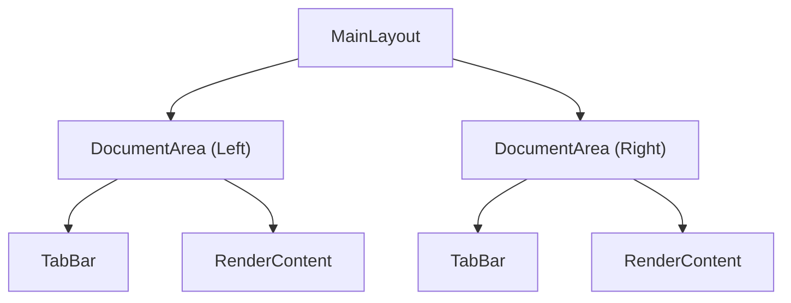

# ドキュメントエリア仕様 (プログラム仕様)

## 1. 概要
`DocumentArea` コンポーネントは、アプリケーションの中央部分にあるドキュメント編集および閲覧領域をカプセル化したコンポーネントです。タブバーと、その下に表示される各種ビュー（エディタ、プレビュー、ブラウザ等）を管理します。

## 2. コンポーネント構造
`DocumentArea` は、`MainLayout` から左右それぞれのペインに対してインスタンス化されます。

## 3. Props インターフェース
`DocumentAreaProps` は、親コンポーネント（`MainLayout`）から状態とコールバックを受け取ります。

| プロパティ | 型 | 説明 |
| :--- | :--- | :--- |
| `side` | `'left' \| 'right'` | このエリアの配置（左か右か） |
| `activeSide` | `'left' \| 'right'` | 現在アクティブなペイン |
| `tabs` | `Tab[]` | 表示するタブのリスト |
| `activePath` | `string \| null` | 現在表示中のドキュメントのパス |
| `isSplit` | `boolean` | 画面分割状態かどうか |
| `documents` | `Record<string, DocumentData>` | 全ドキュメントのデータ（内容、メタデータ等） |
| `splitRatio` | `number` | 分割比率（0.0 ～ 1.0） |
| `onSetActive` | `() => void` | このエリアがアクティブになった際の通知 |
| `onRename` | `(newName: string) => Promise<void>` | ファイル名の変更処理 |
| `onNavigated` | `() => void` | エディタ内でのナビゲーション（行移動等）完了通知 |
| `leftActivePath`, `rightActivePath`, `leftTabs`, `rightTabs` | - | `ChView` 等での相互連携用 |

## 4. コンテンツレンダリングロジック
`activePath` の形式やファイルの拡張子、ドキュメントの `language` メタデータに基づいて、表示するコンポーネントを切り替えます。

### 4.1 特殊 URI スキーム
- **`preview://<path>`**: プレビュー表示。
  - `language` が `markdown` の場合は `MarkdownPreview`。
  - それ以外は `NovelPreview` (小説形式) を表示。
- **`git-diff://<staged>/<path>`**: `DiffViewer` を表示。
- **`web-browser://<url>`**: `WebBrowser` コンポーネントを表示。

### 4.2 特殊なファイル形式 / メタデータ
- **`language === 'image'`**: 画像ビューアを表示。`nvfs://local/` プロトコル経由で画像を表示します。
- **`.ch` 拡張子**: `ChView` (AIチャットチャンネル) を表示します。

### 4.3 通常のエディタ
上記以外の場合、`CodeEditor` (Monaco Editor) を表示します。上部にはファイル名を表示する `FileNameHeader` が配置されます。

## 5. レイアウトとスタイリング
`DocumentArea` は `isSplit` 状態に応じて `flex-basis` を動的に変更します。
- `isSplit === true` の場合:
  - 左: `splitRatio`
  - 右: `1 - splitRatio`
- `isSplit === false` の場合:
  - `1.0` (全幅)

## 6. イベントハンドリング
- **フォーカス/クリック**: `onFocus` および `onClick` イベントをキャプチャし、親コンポーネントに `onSetActive` を通知してアクティブペインを切り替えます。
- **キーボード**: アクセシビリティのため、`Enter` や `Space` キーでもアクティブ化が可能です。
