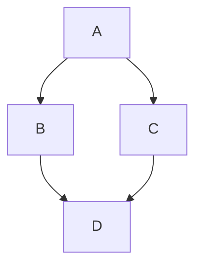
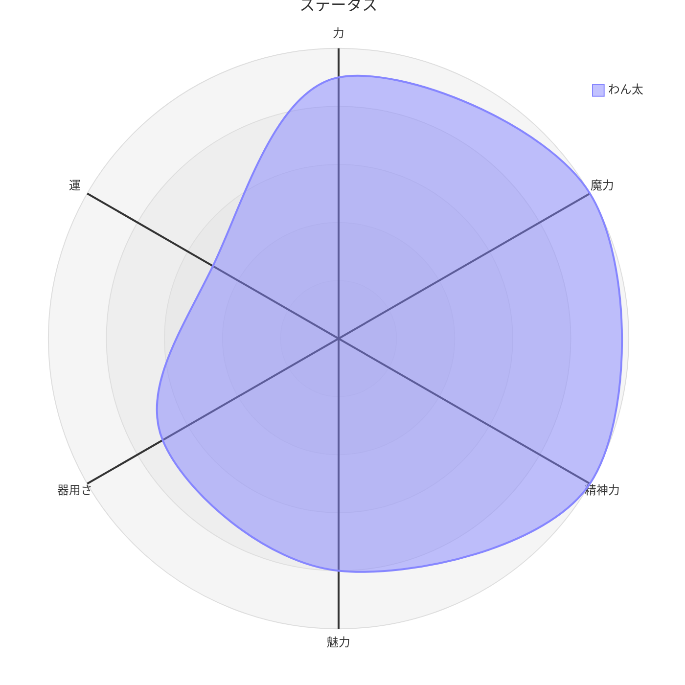

# マークダウンプレビュー

マークダウンファイルをリアルタイムにプレビューする機能。
主に、設定関連でマークダウンファイルを使用することから、視覚的に分かりやすい表現へと変換した表示を行うことも目的とします。

## TODO

### リンクのツールチップ表示

リンク先のツールチップ表示が欲しい

### リンククリック時のエラー
マークダウンプレビュー画面において、リンクをクリックした際にエラーとなる。
これはElectronの仕様にもよるもので、このソフトで処理できるように割り込んだ処理をおこなう必要がある。
ローカルファイルへのリンクの場合、対応するドキュメントを開く処理を行います。
なお、開く際は元のビューに合わせた表示を行うものとします。
`reader`の場合、`reader`ビューで開く。
`preview`の場合、`preview`ビューで開く。
特に、`preview`の場合は元の`editor`がある必要が生じる。
これらの開き方はプラグインからも利用できるようにすることを考え、現状の`openDocument`の仕様を見直す必要がある。

### 画像表示サイズの指定

* ``
のような記法で画像表示サイズの指定ができるようにする。
書き方としては色々あるが、副作用やその他を考慮するとObsidian風の記法が一番良いと思われる。

## 仕様

//TODO 特殊な記法をサポートしている場合、ここに追加

### プラグイン

マークダウン表示に固有の処理や表示を入れる事が可能です。
* MarkdownPreprocessor
  + ルビ表示等
* MarkdownCodePreprocessor
  + コードブロックの変換
  + レーダーチャートの簡易記法をmermaidに変換
* MarkdownCodeProcessor
  + コードブロックのレンダリング
  + mermaidのレンダリング
  + d2のレンダリング
  + 地図表示

### コードブロック

```language
code
```
の形式。

プラグインに対して追加の属性を渡したい場合、

```language{key=value,key2=value2 attr3="value3" attr4=value4 attr5}
code
```
のような形式で渡す事ができる。
key=value もしくは、 keyのみの指定で渡す事ができる。
区切り文字はスペースまたはカンマ。
汎用的に、{width=100px height=100px} のようにサイズ指定が可能なものとします。そのままスタイルに渡せる想定。
ある程度の汎用機能はパース時に処理して取得しやすくしておきます。


## 実装

//TODO 技術的な実装関連について追記してください。

## `mermaid.js`

* `mermaid` 



`mermaid`記法をサポートする。

## D2: Declarative Diagramming

* `d2`

```d2
x -> y -> z
```

`d2`記法をサポートする。

## マップ表示

マークダウンのコードブロックを使用して、`react-map-gl` (MapLibre) を使用したインタラクティブな地図を表示できます。

### 対応言語
以下の言語指定で地図表示が有効になります。
* `carto-paw`: 本プロジェクトのデフォルト
* `carto-pow`: 地図作成ツール互換
* `map`: 一般的な地図指定
* `leaflet`: Obsidian の `obsidian-leaflet` プラグイン互換

### 設定形式
設定は **YAML 形式** で記述します。`obsidian-leaflet` との互換性を考慮したプロパティ名をサポートしています。

#### 基本プロパティ
| プロパティ | 説明 | 備考 |
| :--- | :--- | :--- |
| `lat` | 初期表示の緯度 | `latitude` も可 |
| `long` | 初期表示の経度 | `lng` , `longitude` も可 |
| `defaultZoom` | 初期ズームレベル | `zoom` も可 (デフォルト: 12) |
| `height` | 地図の高さ | 数値(px) または単位付き文字列 |
| `width` | 地図の幅 | 数値(%) または単位付き文字列 |

#### マーカー (`marker` / `markers`)
地点にマーカーを表示します。以下の複数の記述形式に対応しています。

1. **カンマ区切り文字列の配列**
   ```yaml
   marker:
     - "default, -45.035, 168.662, リンク, 説明"
   ```
2. **配列の配列**
   ```yaml
   marker:
     - [Home, -45.035, 168.662, "我が家"] # Lucideアイコン名を指定可能
     - [-41.257, 174.865] # タイプ省略時はデフォルトのピン
   ```
3. **オブジェクトの配列**
   ```yaml
   markers:
     - lat: -45.035
       long: 168.662
       type: "Flag" # アイコン名を指定
       description: "説明文"
   ```

### アイコン
`type` に指定された文字列を **Lucide のアイコン名** として解釈します。
* **変換ルール**: `map-pin` や `map_pin` のような形式も自動的に `MapPin` (PascalCase) に変換されます。
* **デフォルト**: `type` を省略するか `default` を指定した場合、または存在しないアイコン名を指定した場合は `MapPin` アイコンが使用されます。
* **スタイル**:
  * 色: ピンク (`#e91e63`)
  * 塗りつぶし: 白 (`#ffffff`)
  * サイズ: 24px

### 実装の詳細
`src/novelaid-markdown/plugins/map-plugin.tsx` で実装されています。`js-yaml` を使用してパースを行い、`react-map-gl/maplibre` で描画しています。
配置された地図は、コードブロック内の座標やズームレベルが変更されると即座に（再マウントを伴って）更新されます。

## レーダーチャート簡易記法


### 対応言語
* `novelaid-radar`
* `radar`

```novelaid-radar
---
title: "ステータス"
名前: "わん太"
config:
  radar:
    axisScaleFactor: 0.25
    curveTension: 0.1
  theme: base
  themeVariables:
    cScale0: "#FF0000"
    cScale1: "#00FF00"
    cScale2: "#0000FF"
    radar:
      curveOpacity: 0
---
力: 9
魔力: 10
精神力: 10
魅力: 8
器用さ: 7
運: 5
```

のようなレーダーチャートの簡易的な記法をサポートします
処理としては、`novelaid-radar` または `radar` のコードブロックをパースし、`mermaid` のコードブロックに変換しています。
frontmatter部分は処理しない項目についてはそのまま渡すものとします。  
なお、`config:`以下はmermaidのフロントマターとしてそのまま渡すものとします。



このように、既存のコードブロックの記法をパースし、別なコードブロックに変換する処理を、MarkdownCodeProcessorのPreprocessorの機能で処理しています。
これにより、専用の更に簡略化した記法をサポートします。  

https://mermaid.js.org/syntax/radar.html

### TODO

線がカーブであり、TRPG等のステータスを表すには直線が良い。
graticule polygon で指定できる模様。
色合いが標準でモノクロ

